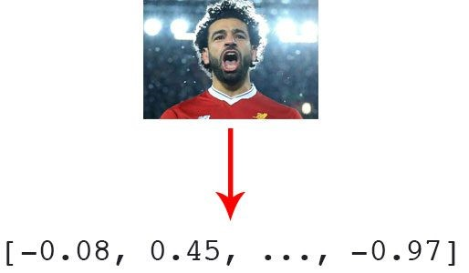

# **DBSCAN**

**Objectif :**

Notre objectif sera d&#39;extraire des caractéristiques quantifiant chaque visage de l&#39;image et de regrouper les « vecteurs de caractéristiques faciales » résultants. Idéalement, chaque personne aura son propre cluster respectif contenant uniquement ses visages.

**Les outils nécessaires :**

- [OpenCV](https://pyimagesearch.com/opencv-tutorials-resources-guides/)
- [dlib](http://dlib.net/)
- [face\_recognition](https://github.com/ageitgey/face_recognition)
- [imutils](https://github.com/jrosebr1/imutils)
- [scikit-learn](http://scikit-learn.org/)

**Extractions descaractéristiques :**

Afin de représenter les visages numériquement, nous quantifions tous les visages de l&#39;ensemble de données avec un vecteur de caractéristiques 128-d généré par un réseau de neurones. Nous utiliserons ces vecteurs de caractéristiques plus tard dans notre clustring.

Pour chacun des visages détectés + encodages, nous construisons un dictionnaire qui comprend :

1. Le chemin vers l&#39;image d&#39;entrée.
2. L&#39;emplacement du visage dans l&#39;image (c&#39;est-à-dire le cadre de délimitation).
3. L&#39;encodage 128-d lui-même.

Ensuite, nous ajoutons le dictionnaire à notre liste de données. Nous utiliserons ces informations plus tard lorsque nous voulons visualiser quelles faces appartiennent à quel cluster, et nous écrivons la liste de données dans un fichier pickle sérialisé.

L&#39;extraction des caractéristiques prend beaucoup de temps et pour ce problème nous déjà fait ce travail et nous enregistrons dans un fichier pickle

**Clustring avec DBSCAN :**

Chargeons les données d&#39;intégration de visage :

1. Chargement des données d&#39;encodage facial à partir du disque.
2. Organisé les données sous forme de tableau NumPy.
3. Extrait les encodages 128-d des données, en les plaçant dans une liste.

**Clustring :**

1. Déclaration de classificateur DBSCAN.
2. **clt.labels\_** contient l&#39;ID d&#39;étiquette pour tous les visages de notre ensemble de données (c&#39;est-à-dire à quel cluster appartient chaque visage).
3. L&#39;ID **-1** est correspond à la &quot;valeur aberrante&quot;.
4. Trouver tous les index dans le tableau « data » qui appartiennent à l&#39;ID d&#39;étiquette actuel.
5. Cree pour chaque étiquette un répertoire.
6. Charger l&#39;image d&#39;entrée est écrire une copie dans son répertoire.
